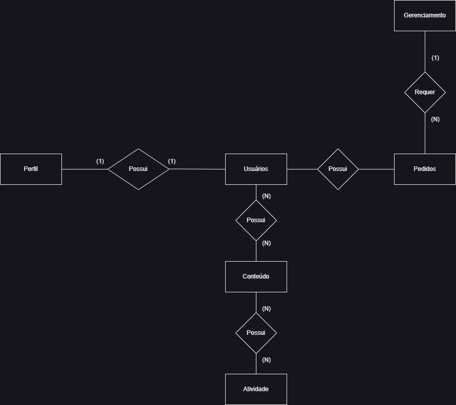
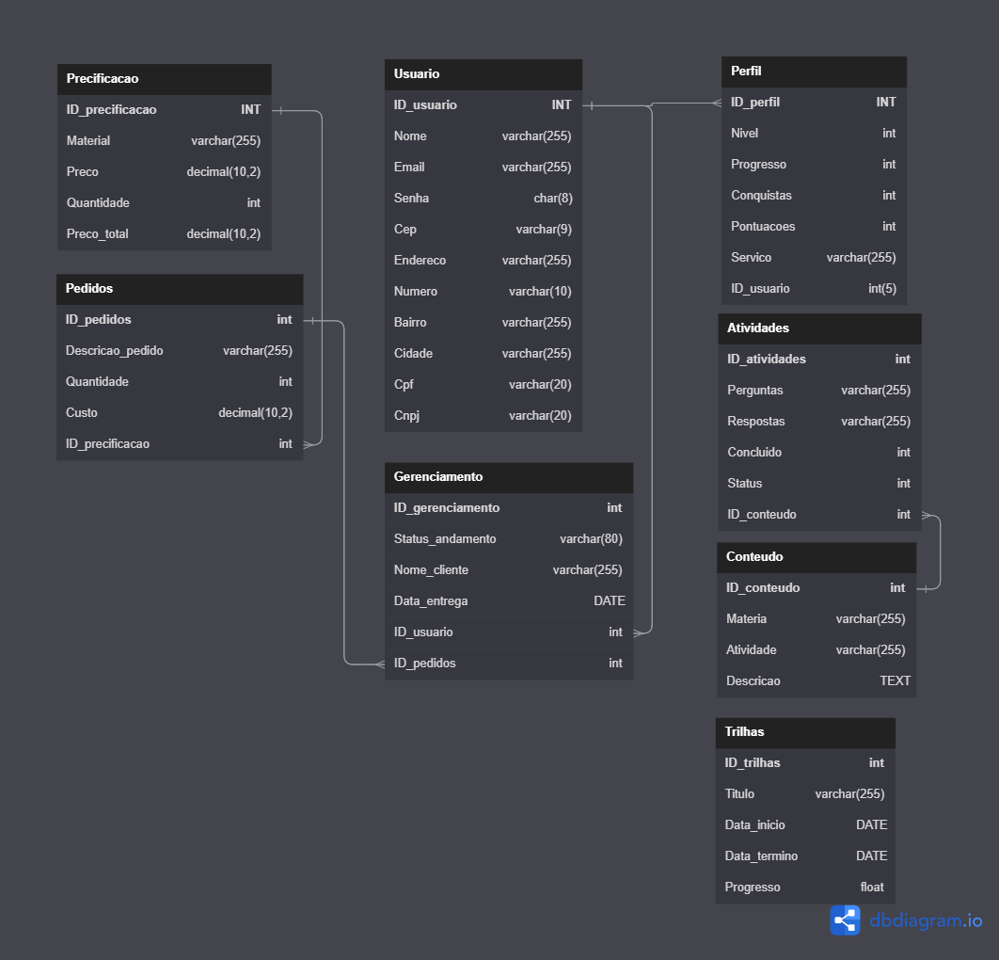
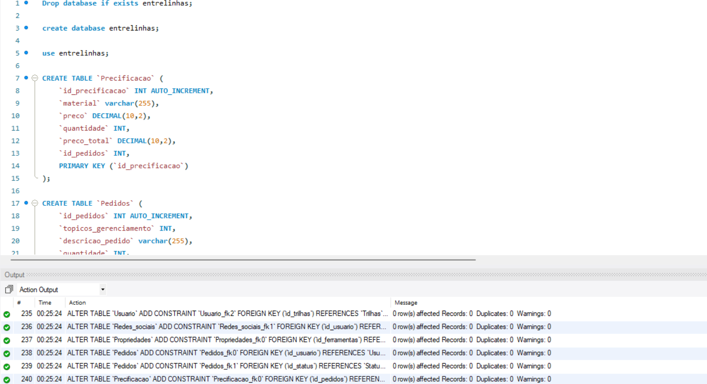
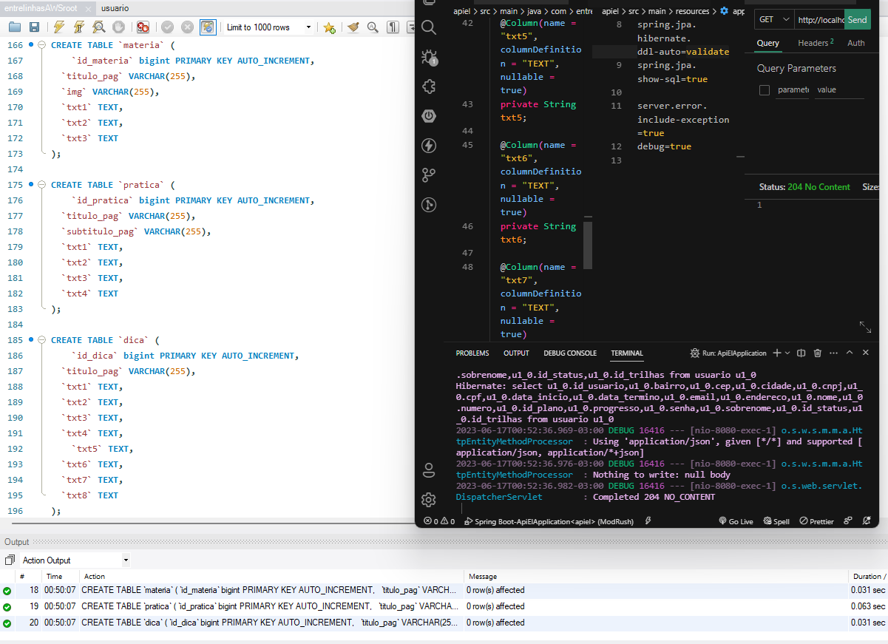

<h1 align="center"> Banco De Dados - Entre Linhas </h1>
 

<h3 align="center"> Modelagem Conceitual </h3>
 </img>
 

<h2 align="center"> Modelagem Lógica </h2>
 </img>
 

<h2 align="center"> Modelagem Física </h2>
<h5 align="center"> Em espera por alterações </h5>
 </img>
 

 

<h2 align="center"> Melhorias </h2>
<h5 align="center"> Alterações aplicadas </h5>
 </img>
 
